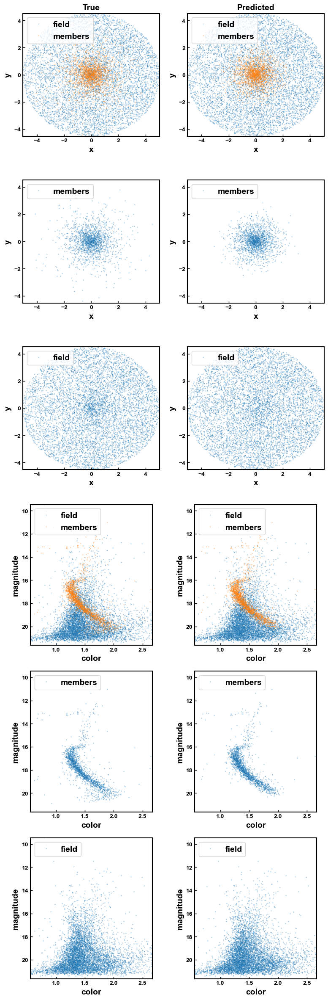

Here I keep different ways to decontaminate a cluster's CMD based only on the photometry of the field and cluster regions.

1. decontaminate_ngc419.ipynb: is method presented in [Cabrera-Ziri et al. (2020)](https://ui.adsabs.harvard.edu/abs/2020MNRAS.495..375C/abstract) based on statistical decontamination of CMD.

2. first_pop_classifier.ipynb: Proof of concept random forest classifier based on Gaia membership labels. This will be developed to be trained on mock data (i.e. without Gaia labels).

This is an example of first_pop_classifier on M4 test set:

## To do:

1. first_pop_classifier.ipynb
    - Try a simple decission tree
2. pop_classifier.ipynb
    - From a sample of (mostly) cluster stars and (mostly) field stars defined from the centre and outskirts
    of cluster, get a model of cluster and field CMD.
    - Distribute uniformly in space field stars. For cluster stars follow Plummer model of the cluster's radius
    - Train classifier using this mock data and check performance
    - Apply classifier on real data
    