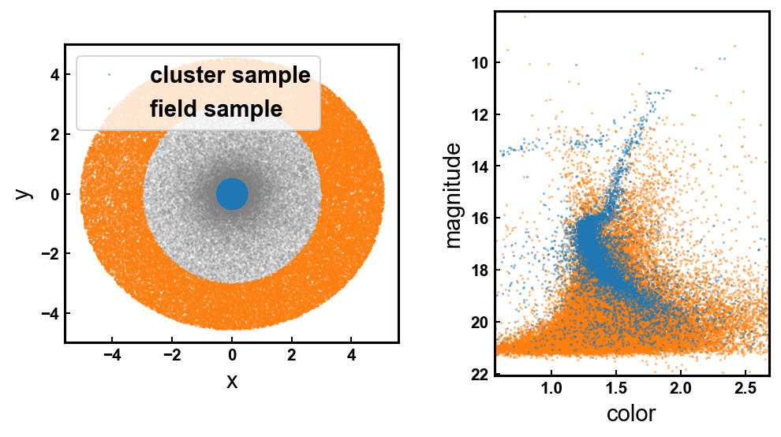

## Overview

The **decontaminate-CMD** project provides tools to distinguish between field and cluster stars using a combination of spatial and photometric data. The main method involves Gaussian Mixture Models (GMM) for CMD modeling and a random forest classifier for star classification.

## Methods Included

- **`decontaminate_ngc419.ipynb`**  
  Implements statistical decontamination of CMD based on [Cabrera-Ziri et al. (2020)](https://ui.adsabs.harvard.edu/abs/2020MNRAS.495..375C/abstract).
- **`first_pop_classifier.ipynb`**  
  A proof-of-concept random forest classifier using perfect membership labels trained on mock data.

- **`pop_classifier.ipynb`**  
  Enhances the first classifier by:
  - Sampling cluster and field stars.
  - Modeling the CMD using GMM.
  - Using the Plummer model for cluster stars and uniform distribution for field stars.
  - Training the classifier on mock data with a similar spatial footprint to real data.

## Features

- **Gaussian Mixture Models (GMM):** Probabilistic representation of CMD data.
- **Random Forest Classifier:** Classifies stars based on CMD positions and spatial distributions.
- **Synthetic Data Generation:**
  - **Cluster Stars:** Distributed according to the Plummer model.
  - **Field Stars:** Distributed uniformly.
- **Performance Evaluation:** Confusion matrix and metrics for classification accuracy.

## Requirements

- Python 3.x
- Jupyter Notebook
- numpy
- pandas
- matplotlib
- seaborn
- scikit-learn
- astroML

3. pop_classifier.ipynb: Based on first_pop_classifier. But:
    - From a sample of (mostly) cluster stars and (mostly) field stars, defined from the centre and outskirts of the cluster.

    

    - Then we model the cluster and field CMD using GMM.

    

    - Distribute field stars uniformly in space. For cluster stars follow the Plummer model of the cluster radius.
    - Train the classifier on this mock data and check performance. *It's very important that spatial footprint is similar to data!!!*.
    
This is an example of first_pop_classifier on M4 data set:

This is the confusion matrix for this dataset:

## To do:

1. first_pop_classifier.ipynb
    - Try a simple decission tree
    
